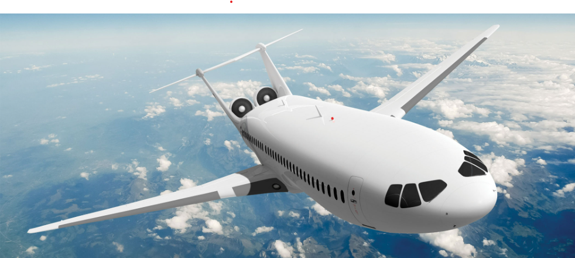
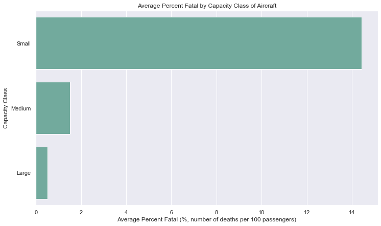
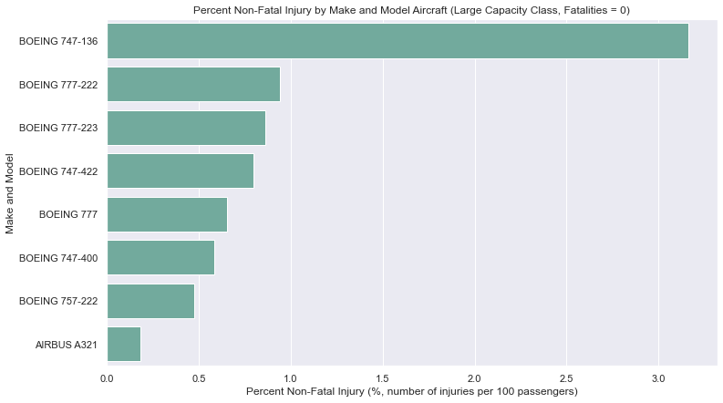
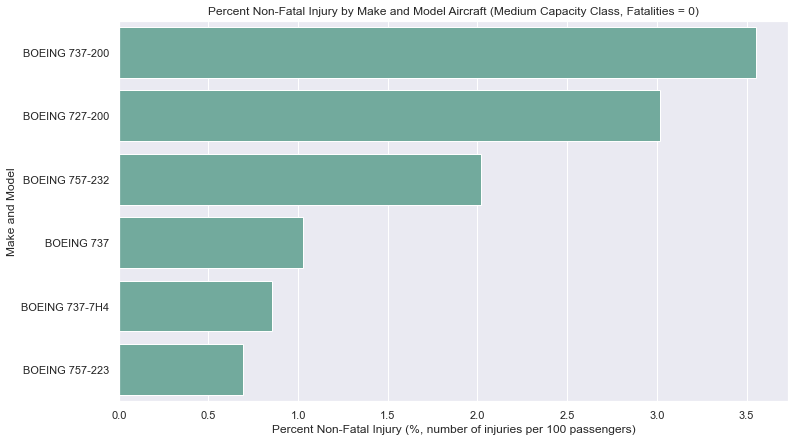
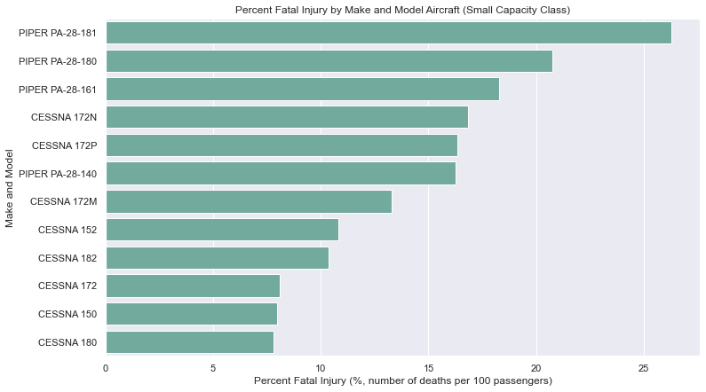

# Aircraft Risk Assessment Analysis


### Analysis Overview


The overall goal of this analysis is to evaluate the [Aviation Accident Database](https://www.kaggle.com/datasets/khsamaha/aviation-accident-database-synopses) to determine which aircraft pose the least amount of risk for injuries. This analysis will show which aircrafts should be taken into account for potential commercial or private use.
- Assesses risk based on fatal and non-fatal injury rates of aircraft models

- Recommendation of three safest aircraft models for each of three passenger capacity classes (small, medium, large)

### Business Problem


A company is expanding into the aircraft industry to
diversify its portfolio. Specifically, they are interested
in purchasing and operating airplanes for commercial
and private enterprises, but are unaware of the potential risks of aircraft. The goal here is to evaluate which aircraft provides the best fit for the company by assessing the personal injury risk by aircraft model.


### Data


The [Aviation Accident Database](https://www.kaggle.com/datasets/khsamaha/aviation-accident-database-synopses) provides extensive data of aircraft accidents since the year 1948. We can use this dataset to find which aircrafts have the smallest potential for injury. The dataset also includes a wealth of data related to aircrafts and the accidents over the past few decades to help us narrow down the best fits.

### Methods


This project uses descriptive analysis to identify aircraft models that meet the following criteria:
- A minimum of 1000 total passengers involved in accidents over the history of the model, for adequate sample size
- Fatal and Non-fatal injury rates were calculated for each model considered:
    - Minimization of fatal injury rates were prioritized
    - For aircraft that did not have fatalities in thier history, non-fatal injury rates were considered

Aircraft were binned into three categories based on passenger capacity (small, medium, large). Recommendations for top three safest aircraft were made for each capacity category based on the criteria above.

### Results

Here we can see the average fatality rates for each class of plane:
- Small: 1-2 passengers
- Medium: 3-150 passengers
- Large: >150 passengers




For the Large class, there were eight models that had zero fatalities, so we evaluate those models based on non-fatal injury rates:



For the Medium class, there were six models that had zero fatalities, so we evaluate those models based on non-fatal injury rates:



For the Small class, all models had fatalities, so we evaluate those models based on fatal injury rates:



# Conclusions

- For the Medium Class aircraft models, we recommend the following, which had the lowest injury rates:
    1. Boeing 757-223
    2. Boeing 737-7H4
    3. Boeing 737
 
 
- For the Large Class aircraft models, we recommend the following, which had the lowest injury rates:
    1. Airbus A321
    2. Boeing 757-222
    3. Boeing 747-400
 
 
- We <u>do not</u> recommend the use of Small Class planes because their fatality rate is much higher.
    - If necessary, small class aircraft with the lowest injury rates were:
        1. Cessna 180
        2. Cessna 152
        3. Cessna 172 

# Next Steps
- Analyze geographic location effects for recommended models to optimize safety
- Acquire non-accident flight record data to analyze the volume of safe flights by model and potential markets
- Return on Investment (ROI) analysis based on MSRP data, purchase availability and loan rates for safe model recommendations

## For More Information

To see the full data analysis check out the [Jupyter Notebook](./Aircraft_Safety_Risk_Analysis.ipynb) or review the [presentation](./Aircraft_Safety_Risk_Analysis_Presentation.pdf)

Also see the Tableau dashboard interactive visuals here: [Tableau Dashboard](./Aircraft_Safety_Risk_Analysis_Dashboard.twb)

For any additional questions contact Dale Deford or James Warsing

Dale Deford: daledeford@gmail.com

James Warsing: warsingjt@gmail.com

## Repository Structure

```
├── data
├── images
├── README.md
├── Aircraft_Safety_Risk_Analysis_Dashboard.twb
├── Aircraft_Safety_Risk_Analysis_Presentation.pdf
└── Aircraft_Safety_Risk_Analysis.ipynb
```


```python

```
